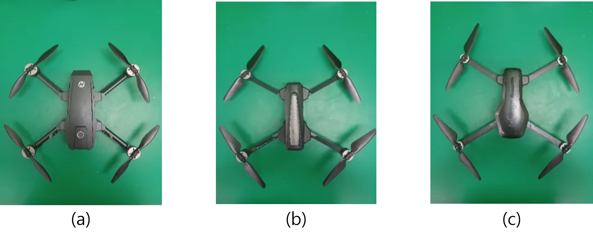
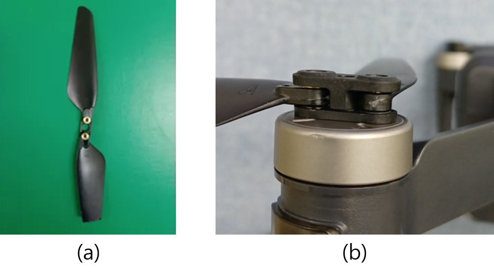
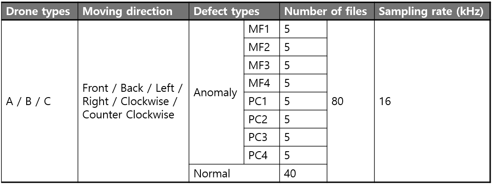

# ICSV31-AI-Challenge

This repository contains of 2025 ICSV31 AI Challenge descriptions and baseline code.

## Update history

2025-01-31 23:00 (KST): Challenge Launch

## Introduction

**2025 ICSV AI Challenge** aims to diagnose the state of drones by detecting anomalous sounds caused by mechanical failures in propellers and motors in noisy environments. In particular, drone sounds that vary depending on operational conditions, such as flight directions, along with background noise, make this task highly challenging.

The ultimate goal of the competition is to develop anomaly detection models capable of identifying anomalies in drones using data collected under various conditions.

- Participants will train deep learning models using training dataset and are required to effectively detect anomalous drone sounds using test datasaet.
- Reflecting the real-world limitation of collecting a small amount of anomalous drone data, participants will tackle the challenge of distinguishing between normal and anomalous drone sounds by training deep learning models exclusively on normal drone data. (*Self-Supervised Learning*) 
- The training dataset includes normal sounds from three types of quadcopter drones maneuvering in six flight directions. The evaluation dataset contains anomalous sounds from six types of faulty drones with motor or blade tip defects. The test dataset introduces two new types of anomalies that were not included in the training phase. Additionally, all datasets are augmented with environmental noise from four distinct locations to simulate real-world conditions.
- After training, participants must calculate and submit anomaly scores for both evaluation dataset and test dataset containing a mix of normal and anomalous drone data.

## Dataset

Dataset for ICSV31 AI Challenge: https://drive.google.com/file/d/1Lbw1mxgNWTBWjsR1IIzC97UCihdD9-bO/view?usp=sharing

The drones used in this study include the Holy Stone HS720 **(Type A)**, MJX Bugs 12 EIS **(Type B)**, and ZLRC SG906 Pro2 **(Type C)**.

Figure 1: Three drone types used for the experiment.
(a) Type A (Holy Stone HS720), (b) Type B (MJX Bugs 12 EIS), (c) Type C (ZLRC SG960 pro2)

Drone sounds were recorded using a RØDE Wireless Go2 wireless microphone, which was mounted on the top of the drone. The sensitivity was adjusted to prevent clipping even at high sound pressure levels. The recordings were conducted in an anechoic chamber to eliminate wall reflections.

Figure 2: (a) Røde Wireless Go2 microphones (transmitter, receiver), (b) recording sounds of drone type B 

The recorded drone sounds, originally sampled at 48 kHz, were downsampled to 16 kHz and segmented into 2 second segments.
- The drone sounds were mixed with background noise at a signal-to-noise ratio (SNR) of 10–15 dB, and additional outdoor noise was incorporated at an SNR of -5 to 5 dB to simulate real-flight conditions. The outdoor noise consisted of recordings from three distinct campus locations (ponds, hills, and gates), as well as industrial noise from ToyADMOS Noise, which was recorded in a real factory environment.

Figure 3: Three different spots on the university campus chosen for background noise recording: (a) pond, (b) hill, and (c) gate.

- The drones were secured with two elastic ropes connected to the ceiling and floor, allowing free rotation and movement. A rotating ring was employed to minimize the impact of the ropes on the drone's motion.
- The drone state labels comprise nine categories, including the normal state, four types of propeller defects, and four types of motor defects. The movement direction labels include six categories: forward, backward, right, left, clockwise, and counterclockwise.
- The types of drone defects include ***propeller defects*** (induced by cutting approximately 10% of a single propeller to generate abnormal vibrations) and ***motor defects*** (created by denting the motor cap using a vise to increase friction and hinder rotation).

Figure 4: Faults of drone type B. (a) propeller cut, (b) dented motor cap (red circle indicates dented part)

### Dataset category

Data is provided in three categories: `train`, `eval`, and `test` for competition submission.

> The `eval` and `test` datasets must not be used for model training.  

- The `train` dataset consists of data from drones without defects.
- The `eval` dataset is provided for assessing the performance of the developed model.
- The `test` dataset, along with the `eval` dataset, is intended solely for competition submission. It should only be used to perform anomaly diagnosis using the trained model and submit the results.
- The `eval` dataset includes six types of defects: three propeller defects and three motor defects. In contrast, the `test` dataset contains a total of eight defect types, incorporating one additional propeller defect and one additional motor defect not present in the `eval` dataset.

### Dataset composition

**File Names**

**Train and Evaluation Data (5,400 train files, 1,080 eval files)**

The filenames for the `train` dataset follow the format:

**`[dataset]_[drone_type]_[moving_direction]_[anomaly_type]_[data_index].wav`**

where:

- `[dataset]` represents the dataset type (`train` / `eval` / `test`).
- `[drone_type]` denotes the drone type (`A` / `B` / `C`).
- `[moving_direction]` indicates the movement direction (`Front` / `Back` / `Right` / `Left` / `Clockwise` / `CounterClockwise`).
- `[anomaly_type]` specifies whether the data corresponds to a normal or anomalous condition (`normal` / `anomaly`).
- `[data_index]` is a unique identifier for the data file.

    

**Test Data (Total 1,440 files)**

The filenames for the `test` dataset follow the format:

**`[dataset]_[drone_type]_[moving_direction]_[data_index].wav`**

### Noise addition

To create a dataset that closely resembles real-world industrial environments, background noise recorded from real outdoor environments and ToyADMOS background noise were added to the vibration signals at a signal-to-noise ratio (SNR) of [-5, 5] dB.

The outdoor noise sources include recordings from **three distinct campus locations (ponds, hills, and gates)** as well as **ToyADMOS Noise**, which represents noise from **a real factory environment**.

### Data specification

**train dataset**

- The number of files per drone type is **1,800**.
- The total number of files is **5,400**.

**evaluation dataset**

- The number of types is **60** per drone type, movement direction, and anomaly type.
- The total number of files is **60 × 3 (drone types) × 6 (movement directions) = 1,080**.
- **MF**: Motor Cap Fault
- **PC**: Propeller Cut

**test dataset**

- The number of types is **80** per drone type, movement direction, and anomaly type.
- The total number of files is **80 × 3 (drone types) × 6 (movement directions) = 1,440**.

## Baseline systems

This challenge provides a baseline code.  
However, using or improving the baseline model is not mandatory for participation.  
Teams are free to utilize their own models.

The code consists of three files:

- **`train.py`**: Trains a deep learning model using the train dataset.
- **`eval.py`**: Evaluates the model performance using the validation dataset.
- **`test.py`**: Extracts anomaly scores for the test dataset.

### Model architecture

The baseline model utilizes **WaveNet** to perform a prediction task on spectrograms.  
WaveNet is primarily used as an audio generation model for anomalous sound detection. Due to its exponentially increasing dilation rate in each residual block, it has a wide receptive field.  

Additionally, it performs causal convolution to predict future spectral frames in the spectrogram.  
The trained model effectively minimizes prediction error for normal data, while showing significantly higher prediction errors for anomalous data. This characteristic is leveraged for anomaly detection.

### Anomaly score

The **anomaly score** is computed using the mean squared error (MSE) between the target spectrogram and the predicted spectrogram.

Let the input spectrogram be $\mathbf{X} = [\mathbf{x}_1, \dots , \mathbf{x}_T] \in R^{F \times T},$ where $F$ and $T$ represent the **frequency** and **time** dimensions of the spectrogram, respectively.

The model $\psi_{\phi}$ takes input data of length equal to the receptive field, $[\mathbf{x}_1, \dots, \mathbf{x}_l]$, and predicts the next spectral frame $\hat{\mathbf{x}}_{l+1}$. This is formulated as:
$\hat{\mathbf{x}}_{t+1} = \psi_{\phi}(\mathbf{x}_{t-l+1}, \cdots, \mathbf{x}_{t}).$

Given the input data $\mathbf{X} = [\mathbf{x}_1, \dots , \mathbf{x}_T],$ the model predicts $\hat{\mathbf{X}} = [\hat{\mathbf{x}}_{l+1}, \dots, \hat{\mathbf{x}}_{T+1}]$.

The **anomaly score** for each data point is computed as:
$\text{Score} = \frac{1}{T-l} \sum_{t=l+1}^{T} \|\mathbf{x}_t - \hat{\mathbf{x}}_t \|^2$, where the mean squared error (MSE) measures the deviation between the actual and predicted spectrogram frames.

### Baseline results

The **baseline model** was trained for **100 epochs** with a **learning rate of 1e-3** and a **batch size of 64**.  

The anomaly detection performance for the evaluation dataset is as follows:

|Drone | A    | B | C |
|----|----------|----------|----------|
|AUC (%)| 69.62   | 74.88   | 67.41   |

## Evaluation metrics

The evaluation metric for this challenge is **ROC-AUC (Receiver Operating Characteristic - Area Under the Curve, AU-ROC)**. ROC-AUC evaluates how well the distributions of normal and anomalous data are separated, independent of any specific decision boundary.

- **ROC-AUC** represents the relationship between the False Positive Rate (FPR) and the True Positive Rate (TPR) in the form of a curve, and the area under this curve (AUC) is used as a numerical measure of model performance.
- The ROC-AUC score ranges from **0 to 1**, where a value closer to **1** indicates that the model is highly effective at distinguishing between normal and anomalous data.
- An AUC score of **0.5** suggests that the model performs no better than random guessing in separating normal and anomalous data.

**ROC-AUC** will be calculated by the **organizing committee** using the `.csv` files submitted by participants. (Participants are not required to calculate or submit the ROC-AUC score themselves.)

## Submission

Submission link: https://docs.google.com/forms/d/e/1FAIpQLSdEnCw_p9yT6ONhb3zgaesTu2ZxtcYCIuEksVaZzMCmhUVoCw/viewform

Participants must submit a total of **four files** for challenge participation:

1. **Evaluation dataset performance** (`eval_score.csv`)
2. **Test dataset performance** (`test_score.csv`)
3. **Reproducible training and evaluation code** (`.zip`)
4. **Technical report** (`.pdf`)

The `eval.py` and `test.py` files generate and save the **anomaly scores** for the evaluation and test datasets as `eval_score.csv` and `test_score.csv`, respectively.  
The **organizers** will use these files to compare the performance of participants' models.

Participants must submit code that can **reproduce the model’s performance**.  
The trained model file should be included in a compressed **zip file**, which must contain all necessary components to generate `eval_score.csv` and `test_score.csv`.

The **technical report** should describe:

- The proposed anomaly detection model architecture
- The model training process
- The anomaly detection methodology

The report must be **1 to 2 pages** in **free format**.

## 📢 Contact: Organizers

For any inquiries, please feel free to reach out to the organizers:

📧 **Jung-Woo Choi** – [jwoo@kaist.ac.kr](mailto:jwoo@kaist.ac.kr)  
📧 **Jihoon Choi** – [wlgns2533@kaist.ac.kr](mailto:wlgns2533@kaist.ac.kr)  
📧 **Yewon Kim** – [yewon@kaist.ac.kr](mailto:yewon@kaist.ac.kr)  
📧 **Seojin Park** – [seojin@kaist.ac.kr](mailto:seojin@kaist.ac.kr)  

We look forward to your participation and are happy to assist with any questions!
